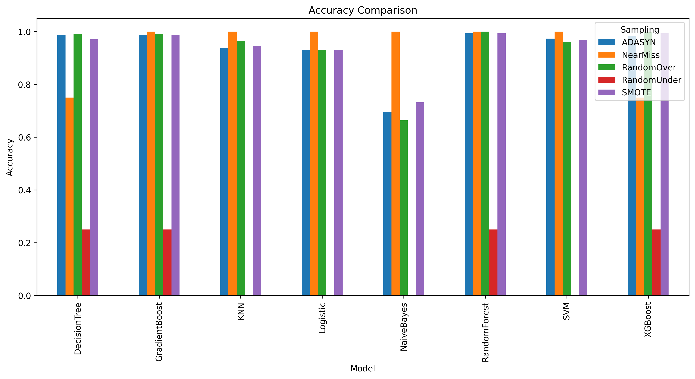
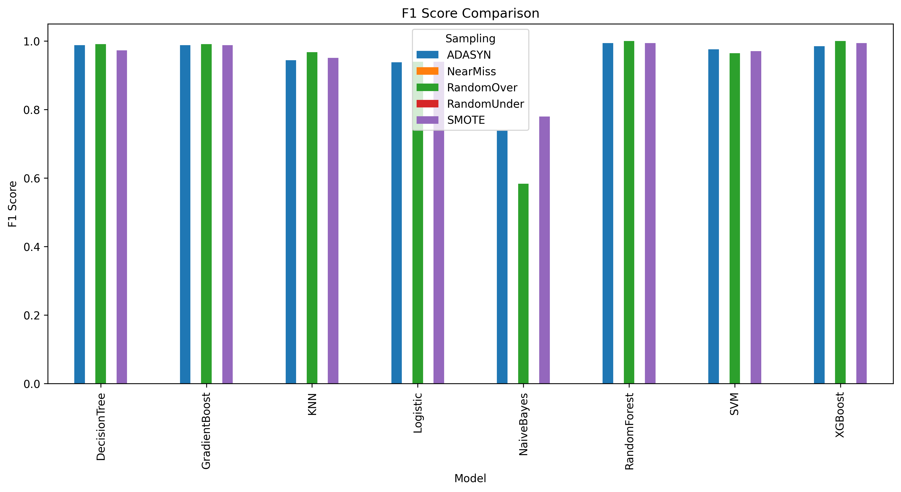
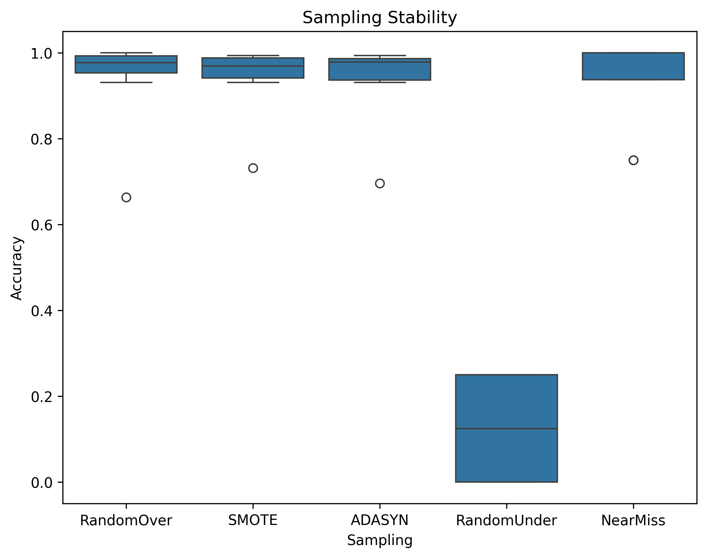
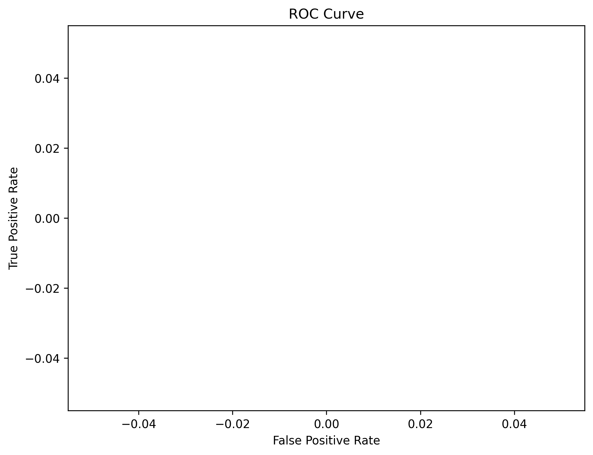
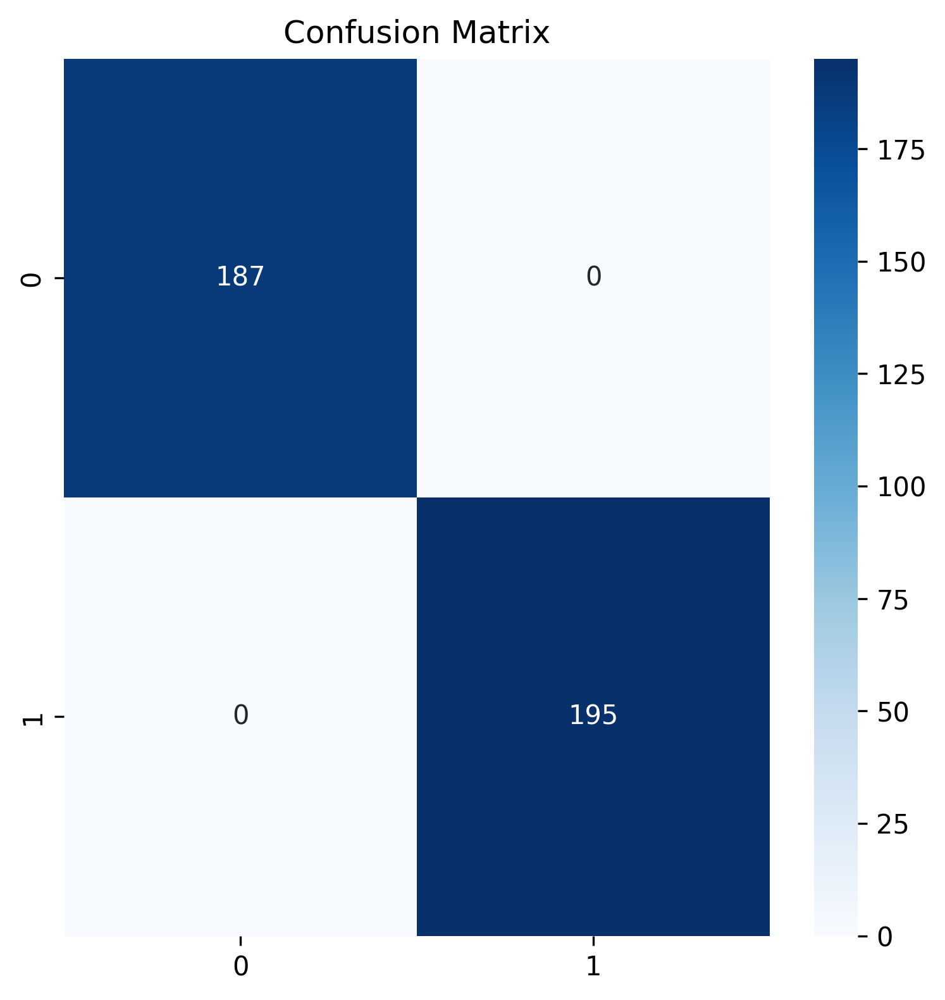
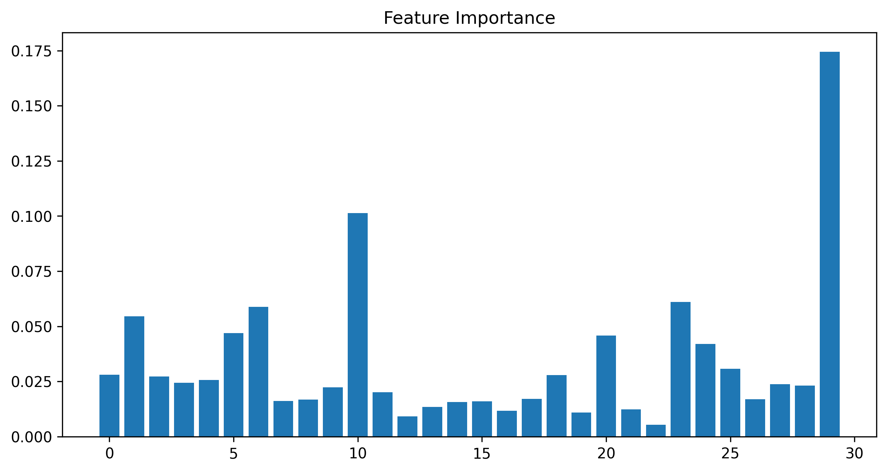
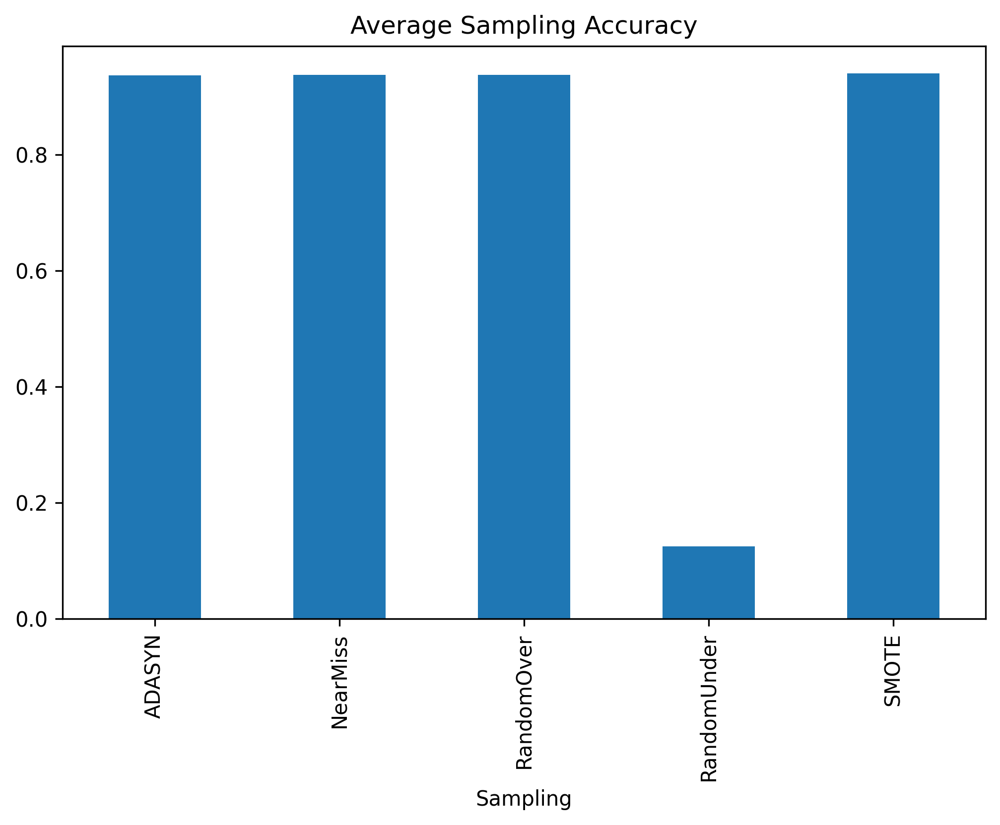
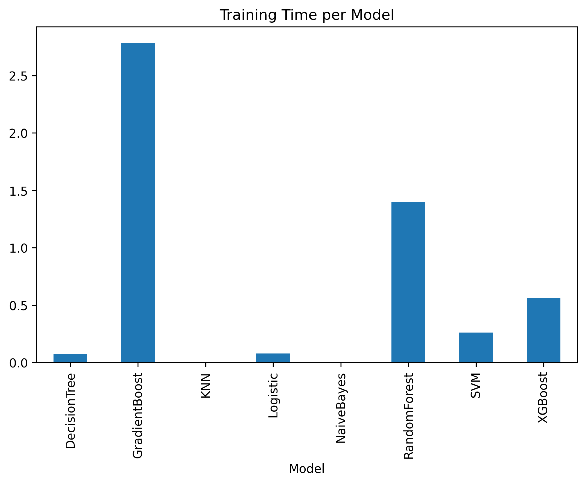

# Sampling Techniques for Imbalanced Credit Card Fraud

This project evaluates multiple sampling strategies on the Credit Card Fraud dataset and compares model performance across several classifiers. It includes exploratory analysis, resampling, model training, and visualization of results.

## Dataset
- **File**: `Creditcard_data.csv`
- **Target**: `Class` (fraud vs. non‑fraud)

## Methods
Sampling techniques:
- Random Over-Sampling
- SMOTE
- ADASYN
- Random Under-Sampling
- NearMiss

Models evaluated:
- Logistic Regression
- Decision Tree
- Random Forest
- SVM
- KNN
- XGBoost
- Naive Bayes
- Gradient Boosting

## Project Structure
- `sampling_assignment.py` — main analysis (exported from notebook)
- `Sampling_Assignment.ipynb` — original notebook
- `Creditcard_data.csv` — dataset
- `plots/` — saved figures

## Environment Setup
Create a virtual environment and install dependencies:

```
python -m venv .venv
.venv\Scripts\activate
pip install -r requirements.txt
```

## Run
Open the notebook or run the script:

```
python sampling_assignment.py
```

## Results & Plots
Below are the key outputs generated in the `plots/` folder.

### Accuracy Comparison


### F1 Score Comparison


### Sampling Stability (Accuracy Distribution)


### ROC Curve


### Confusion Matrix (Best Model)


### Feature Importance (Random Forest)


### Average Accuracy by Sampling


### Training Time per Model


## Notes
- The script was exported from a Colab notebook and may include notebook-specific commands. The notebook version is recommended for interactive exploration.

## License
MIT. See LICENSE.
